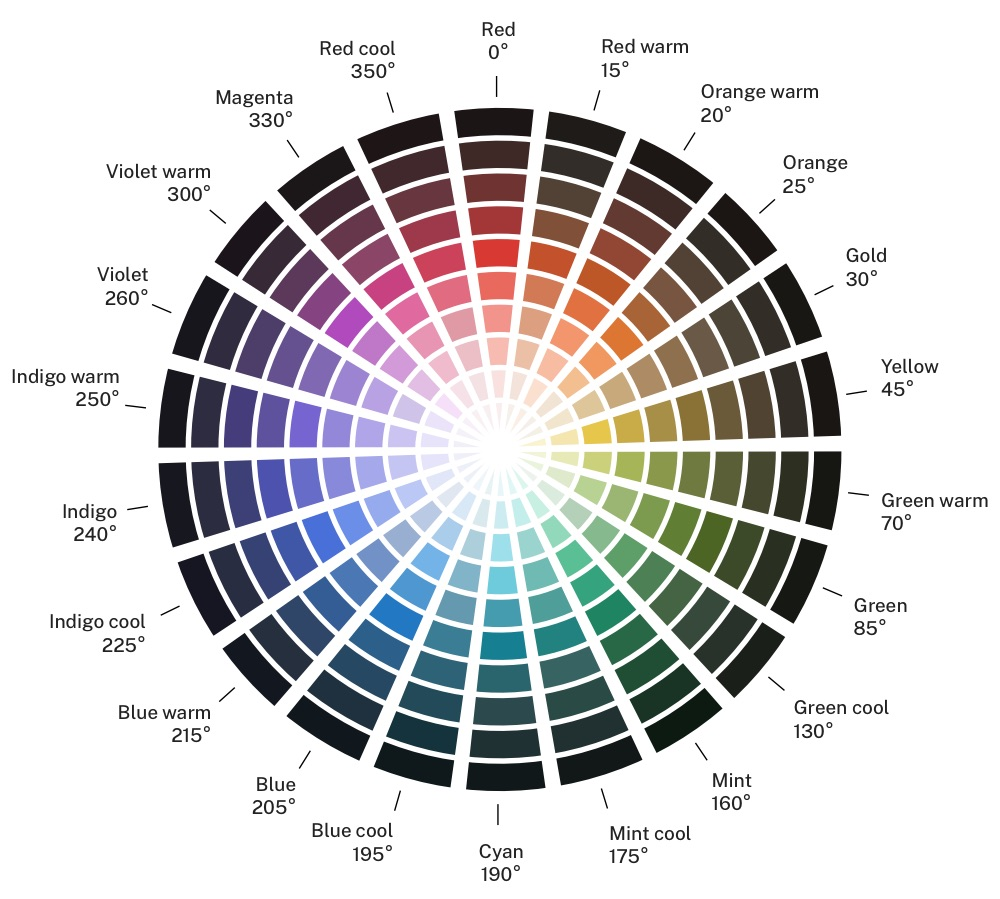
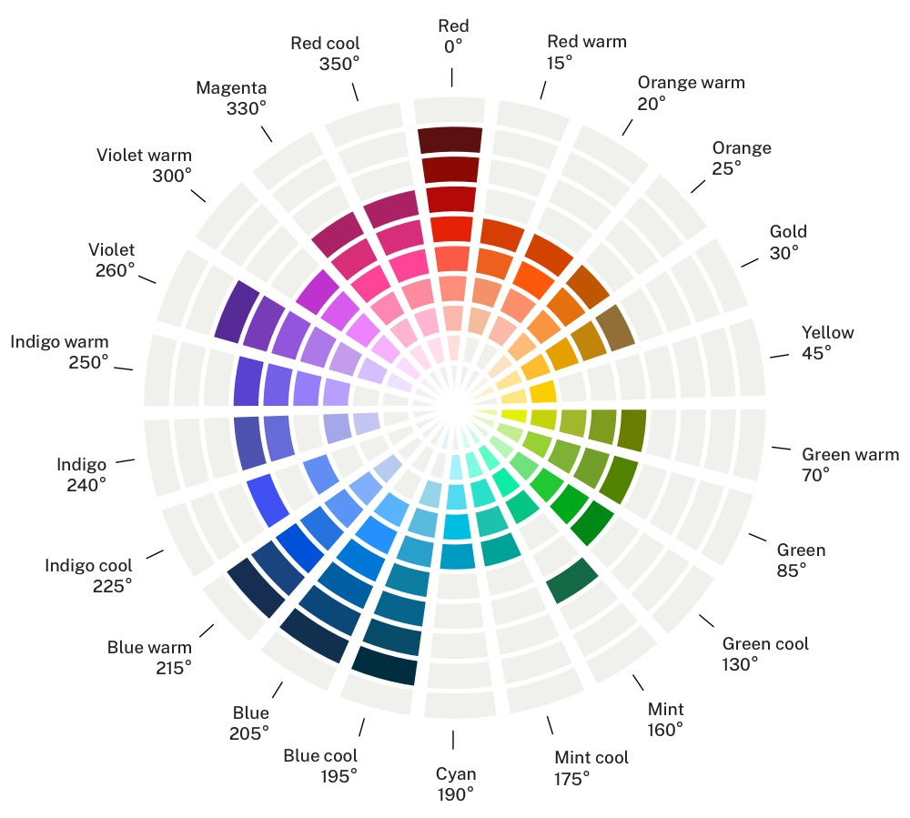

# README

Tailwind Accessibility Config Project: For a more accessible Tailwind!

# Table of Contents

1. [README](#readme)
2. [Description](#description)
3. [Accessible Color Pairings](#accessible-color-pairings)
4. [Color Wheels](#color-wheels)
5. [General Color Guidance](#general-color-guidance)
6. [Development](#development)
7. [Contributing](#contributing)
8. [License](#license)
9. [Code of Conduct](#code-of-conduct)
10. [Links and Files](#links-and-files)
11. [Ending Remarks](#ending-remarks)

## Description

I am building this TailwindCSS setup for a Tailwind style palette selection using the USG defined accesibility standards in a familiar well thought out Tailwind format to make it just as easy so that everyone can use the web with the same ease.

Tailwind colors replaced (in Tailwind style) by the USG standards for accesibility colors defined at: https://designsystem.digital.gov/

Primary Source: [US Government design accesibilty color rules](https://designsystem.digital.gov/design-tokens/color/overview/)

## Accessible Color Pairings

USWDS created a color grade system which helps people choose accesible colors from grades (originally based on 5-90 where 0 is right) based on 000 to 1000. 000 is white and 1000 would be black, the colors step in grades usually by 100 except for gray which steps in 10s until 50, then from 100-900 by hundreds

To choose an accesible color, use the magic number:

> A magic number is the difference in color grade done by {color A} - {color B} = {magic number}

1. A magic number of 40+ results in WCAG 2.0 AA Large Text contrast
2. A magic number of 50+ results in WCAG 2.0 AA contrast or AAA Large Text contrast
3. A magic number of 70+ results in WCAG 2.0 AAA contrast
4. Colors of grade 50 result in Section 508 AA contrast against both pure white (000) and pure black (1000)

Use USWDS magic numbers to choose accessible color combinations from any palette and color family.
 
## Color Wheels

**USWDS standard system color tokens wheel**

**USWDS vivid system color tokens wheel**

## General Color Guidance

If we use color intentionally, consistently, and sensitively, it can make a big difference in the way people understand and connect with our pages, our products and services, and our message. Color is an important component of visual and emotional cognition, and that’s precisely what makes it difficult to use well — what’s strong and confident to one person can be jarring or alarming to another.

**Start in black and white.** Start with your core message and use type scale and hierarchy to test and refine its effectiveness. Then introduce color to support that message. Color can overwhelm interpretation, and since approximately 4.5% of the population has some kind of color insensitivity, it’s important not to rely on color to convey information critical to your message.

**Put the practical before the emotional.** Because color can do so much, it can be smart to be focused. Limit the complexity of color by concentrating on functional requirements (like status states or directions) first. Then, use color as progressive enhancement to reinforce or balance the emotional needs of the content. Even so, bear in mind that the effects of color are often personal and cultural as much, or more so, than physiological. Understand that using color to optimize for tone necessarily excludes in in subtle and not-so-subtle ways.

**Use mood boards for guidance.** It can be challenging to derive appropriate color palettes, and it makes sense to let existing colors and palettes be your guide. Collect images from other sources that evoke the desired tone to find commonalities. Then, find close matches in the system palette to help build your theme.

**Ask visual designers.** Your group or agency may have visual designers either on staff or available as contractors. They can be an invaluable resource for building palettes or getting feedback on existing ones. USWDS benefits from the collective experience of visual designers across agencies to build our system palette, and to provide a range of prebuilt project theme palettes. If you have visual design resources, use them.

**Don’t use color exclusively to convey meaning.** Even Section 508 conformant contrast doesn’t ensure that colors are distinguishable for a significant percentage of your audience. Approximately 0.5% of adult women and 8% of adult men have some kind of color insensitivity, especially between red and green. Color should only be used as progressive enhancement — if color is the only signal, that signal won’t get through as intended to everyone.

## Development

After checking out the repo, run `npm install` to install dependencies. Then, run `npm run build` to build the css file.

You can copy any part of this to replace existing things in your project.  If you copy the css file, you can use the tailwind classes as tailwind uses them (from what is built).  If you copy more of the configuration such as how it is built, you can use it to add to an existing configuration or incorporate into your project with postcss!

## Contributing

Bug reports and pull requests are welcome on GitHub at https://github.com/optimizasean/TailwindAccessibilityConfig. This project is intended to be a safe, welcoming space for collaboration, and contributors are expected to adhere to the [Contributor Covenant](http://contributor-covenant.org) code of conduct.

If you want to contribute please let me know though either an email or you can just submit a pull request to add anything or open an issue and I can look through it with you!

## License

The gem is available as open source under the terms of the [MIT License](https://opensource.org/licenses/MIT).

## Code of Conduct

Everyone interacting in the TailwindAccessibilityConfig project’s codebases, issue trackers, chat rooms and mailing lists is expected to follow the [code of conduct](https://github.com/optimizasean/TailwindAccessibilityConfig/blob/master/CODE_OF_CONDUCT.md).

## Links and Files

- [TailwindCSS](https://tailwindcss.com/)
- [Code](https://github.com/optimizasean/TailwindAccessibilityConfig)
- [Wiki](https://github.com/optimizasean/TailwindAccessibilityConfig/wiki)
- [Projects](https://github.com/optimizasean/TailwindAccessibilityConfig/projects)
- [Issues](https://github.com/optimizasean/TailwindAccessibilityConfig/issues)
- [Readme](https://github.com/optimizasean/TailwindAccessibilityConfig/blob/master/README.md)
- [Changelog](https://github.com/optimizasean/TailwindAccessibilityConfig/blob/master/CHANGELOG.md)
- [License](https://github.com/optimizasean/TailwindAccessibilityConfig/blob/master/LICENSE)
- [Code of Conduct](https://github.com/optimizasean/TailwindAccessibilityConfig/blob/master/CODE_OF_CONDUCT.md)
- [Contributor Covenant](http://contributor-covenant.org)
- [Pull Requests](https://github.com/optimizasean/TailwindAccessibilityConfig/pulls)
- Security
  - [Advisories](https://github.com/optimizasean/TailwindAccessibilityConfig/security/advisories)
  - [Policy](https://github.com/optimizasean/TailwindAccessibilityConfig/security/policy)
- Insights
  - [Pulse](https://github.com/optimizasean/TailwindAccessibilityConfig/pulse)
  - [Contributors](https://github.com/optimizasean/TailwindAccessibilityConfig/graphs/contributors)
  - [Commits](https://github.com/optimizasean/TailwindAccessibilityConfig/graphs/commit-activity)
  - [Code Frequency](https://github.com/optimizasean/TailwindAccessibilityConfig/graphs/code-frequency)
  - [Dependency Graph](https://github.com/optimizasean/TailwindAccessibilityConfig/network/dependencies)
  - [Network](https://github.com/optimizasean/TailwindAccessibilityConfig/network)
  - [Forks](https://github.com/optimizasean/TailwindAccessibilityConfig/network/members)

## Ending remarks

I did this when I discovered how amazing TailwindCSS is and starting designing websites. When I started, I began thinking about government requirements, Section 508, 18F, and the individual organization level rules about style and so on. Then, afterwards, I decided to make the easy tool I like to use for design accessible and compliant (so long as you follow the rules and use it right - try your best, super hard and confusing but good luck).  I hope this will make the web more open and accesible for everyone!

If you want to contribute, just submit a pull request!  I would love more people to help me add to this to make it even better such as by including fonts and more as well as adding more documentation so everyone can find it all in one place even if it is links or pdfs and so on.
